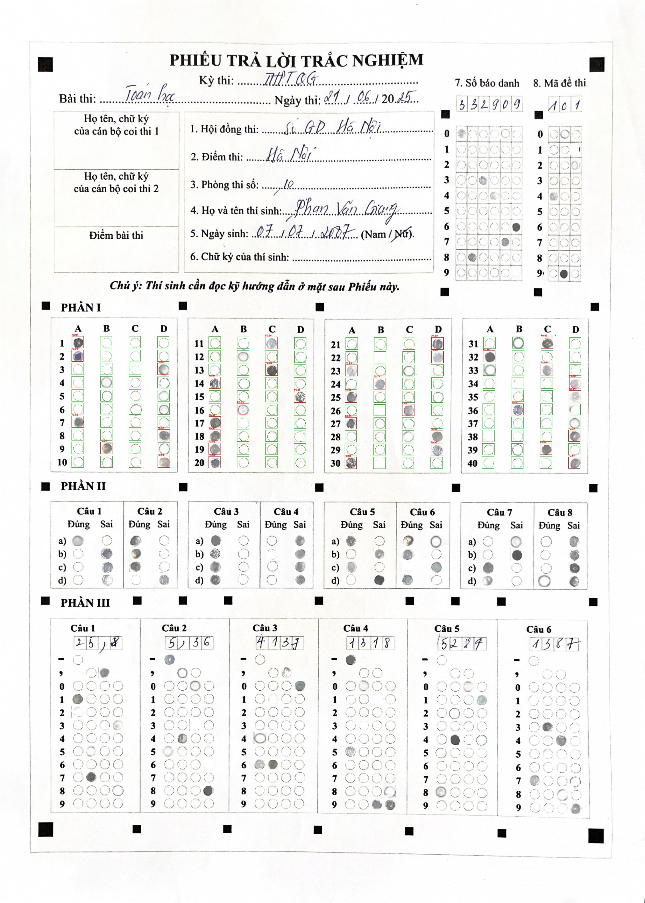

# 🗳️ OMR Answer Sheet Detection & Extraction
### Optical Mark Recognition using YOLOv8 - Grading/Answer Extraction


A computer vision pipeline that automatically detects filled/empty answer bubbles on scanned MCQ answer sheets using a fine-tuned YOLOv8 object detection model, then extracts per-question ABCD answers through coordinate-based post-processing.

---

## 📋 Table of Contents
- [Overview](#overview)
- [Results](#results)
- [Dataset](#dataset)
- [Project Structure](#project-structure)
- [Setup & Installation](#setup--installation)
- [Pipeline & Usage](#pipeline--usage)
- [Sample Output](#sample-output)
- [Authors](#authors)
- [Acknowledgements](#acknowledgements)

---

## Overview

This project solves the problem of manually grading large-scale MCQ examinations. Given a scanned OMR answer sheet, the system:

1. **Detects** all answer bubbles (filled or empty) using YOLOv8
2. **Groups** bubbles into questions and columns using spatial analysis
3. **Assigns** ABCD labels to each detected answer
4. **Exports** structured JSON output ready for downstream grading

The system targets **Phần I** of Vietnamese MCQ exam sheets, which contains 40 questions across 4 column groups (Q1–10, Q11–20, Q21–30, Q31–40), each with 4 options (A, B, C, D).

---

## Results

| Metric | Validation | Test Set |
|--------|-----------|----------|
| **mAP50** | 0.943 | **0.943** |
| **mAP50-95** | 0.814 | **0.836** |
| **Precision** | 0.971 | **0.971** |
| **Recall** | 0.852 | **0.853** |
| **Inference Speed** | — | **7.8ms/image** |

**Per-Class Performance (Test Set):**

| Class | Precision | Recall | mAP50 |
|-------|-----------|--------|-------|
| filled | 0.986 | 0.708 | 0.896 |
| empty | 0.957 | 0.998 | 0.989 |

> Training completed in **1.485 hours** over 30 epochs on NVIDIA GeForce RTX 5060 Ti (8.5GB VRAM).

<p align="center">
  
  
</p>

---

## Dataset

- **Source:** [OMR Dataset — nghaanv on Kaggle](https://www.kaggle.com/datasets/nghaanv/omr-dataset)
- **Format:** YOLO annotation format (normalized bounding boxes)
- **Split:**

| Split | Images | Purpose |
|-------|--------|---------| 
| Train | 3,952 | Model training |
| Validation | 741 | Epoch-wise evaluation |
| Test | 247 | Final held-out evaluation |

**Preprocessing:** Labels were filtered to retain only Phần I annotations using a vertical position threshold of `Y ∈ [0.35, 0.55]`. Filtered labels are stored in separate `labels_phan1/` directories.

---

## Project Structure

```
OMR_CV/
│
├── Datasets/
│   └── YOLO_OMR_Dataset/
│       ├── train/
│       │   ├── images/
│       │   ├── labels/              ← filtered Phần I labels (active)
│       │   └── labels_original/     ← original unfiltered labels
│       ├── valid/
│       │   ├── images/
│       │   └── labels/
│       └── test/
│           ├── images/
│           └── labels/
│
├── runs/
│   ├── detect/
│   │   ├── omr_phan1_new/           ← training results & saved weights
│   │   │   └── weights/
│   │   │       ├── best.pt          ← best model checkpoint
│   │   │       └── last.pt
│   │   ├── omr_single_predict/      ← single image prediction output
│   │   └── omr_all_predict/         ← batch prediction outputs
│   └── omr_extraction/
│       └── all_answers.json         ← extracted answers for all test images
│
├── assets/                          ← README images
├── dataset.yaml                     ← YOLO dataset config
├── train.py                         ← model training script
├── test.py                          ← model evaluation on test set
├── predict.py                       ← single image prediction + visualization
├── predictAll.py                    ← batch prediction on all test images
├── grade.py                         ← answer extraction for single image
├── extract_all.py                   ← batch answer extraction → JSON
└── requirements.txt
```

---

## Setup & Installation

### Prerequisites
- Python 3.9+
- NVIDIA GPU with CUDA support (recommended)
- 8GB+ VRAM for training

### 1. Clone the Repository
```bash
git clone https://github.com/nishaankr/OMR_CV.git
cd OMR_CV
```

### 2. Create and Activate Virtual Environment
```bash
python -m venv omr_env

# Windows (PowerShell)
.\omr_env\Scripts\activate

# macOS / Linux
source omr_env/bin/activate
```

### 3. Install Dependencies
```bash
pip install ultralytics opencv-python numpy torch torchvision
```

### 4. Set Up Dataset
Place the dataset in the following structure:
```
Datasets/YOLO_OMR_Dataset/
    train/images/   train/labels/
    valid/images/   valid/labels/
    test/images/    test/labels/
```

Ensure `dataset.yaml` points to the correct paths:
```yaml
train: Datasets/YOLO_OMR_Dataset/train/images
val:   Datasets/YOLO_OMR_Dataset/valid/images
test:  Datasets/YOLO_OMR_Dataset/test/images
nc: 2
names: ['filled', 'empty']
```

---

## Pipeline & Usage

The project follows a sequential pipeline. Run each script in order:

### Step 1 — Train the Model
```bash
python train.py
```
Trains YOLOv8n on the filtered Phần I dataset for 30 epochs.  
Best model saved to: `runs/detect/omr_phan1_new/weights/best.pt`

---

### Step 2 — Evaluate on Test Set
```bash
python test.py
```
Runs the trained model on the 247 held-out test images and prints mAP50, mAP50-95, Precision, and Recall.

---

### Step 3 — Visualize Predictions (Single Image)
```bash
python predict.py
```
Runs the model on a single test image and saves an annotated output with:
- 🟥 Red boxes = filled bubbles
- 🟩 Green boxes = empty bubbles

Output saved to: `runs/detect/omr_single_predict/`

---

### Step 4 — Batch Prediction (All Test Images)
```bash
python predictAll.py
```
Runs prediction on all 247 test images and saves annotated versions.  
Output saved to: `runs/detect/omr_all_predict/`

---

### Step 5 — Extract Answers (Single Image)
```bash
python grade.py
```
Runs the full answer extraction pipeline on a single image:
1. Crops image to Phần I region
2. Detects bubbles with YOLOv8
3. Auto-detects X-group boundaries (Q1–10, Q11–20, Q21–30, Q31–40)
4. Groups bubbles into rows by Y-coordinate
5. Assigns A/B/C/D per question
6. Prints structured Q1–Q40 answer table

---

### Step 6 — Batch Answer Extraction (All Test Images → JSON)
```bash
python extract_all.py
```
Processes all test images and saves a single structured JSON file.  
Output saved to: `runs/omr_extraction/all_answers.json`

**JSON structure:**
```json
[
  {
    "image": "IMG_1584_iter_24.jpg",
    "bubble_count": 161,
    "answered": 37,
    "blank": 3,
    "answers": {
      "Q1": "A", "Q2": "A", "Q3": "D",
      "Q4": "—", "Q5": "D", "Q6": "—",
      ...
      "Q40": "D"
    }
  }
]
```

---

## Sample Output

**Prediction Visualization:**

Detected bubbles drawn with thin bounding boxes. Red = filled, Green = empty. Labels show confidence scores only for filled bubbles (`F0.93`).

<p align="center">
  
</p>

**Answer Extraction Console Output:**
```
Q      A      B      C      D      Answer
---------------------------------------------
Q1    [A]    B      C      D     → A
Q2    [A]    B      C      D     → A
Q3     A     B      C     [D]    → D
Q4     A     B      C      D     → — (blank)
Q5     A     B      C     [D]    → D
...
Q40    A     B      C     [D]    → D

Total questions : 40
Answered        : 37
Left Blank      : 3
```

---

## Authors

| Name | GitHub |
|------|--------|
| Nishaank Singh Rawat | [@nishaankr](https://github.com/nishaankr/) |
| Shanya Rai | [@shanya]([#](https://github.com/shanyarai)) |

---

## Acknowledgements

Dataset sourced from Kaggle:  
**[OMR Dataset — nghaanv](https://www.kaggle.com/datasets/nghaanv/omr-dataset)**  
We gratefully acknowledge the dataset author for making this resource publicly available.

---

> **Note:** The model weights (`best.pt`) are not included in this repository due to file size. Run `train.py` to reproduce the trained model.
